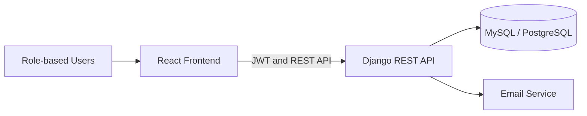

# TraceNet

A secure, role-based intelligence and response system for managing human trafficking cases, victims, routes, hotspots, alerts, analytical reports, and audit activities.

[](https://github.com/imanjayed12/TraceNet/actions/workflows/backend-ci.yml)


## Overview

TraceNet centralizes trafficking-related case information and supports coordinated action among law-enforcement officers, NGO workers, analysts, government authorities, and system administrators.

The platform combines secure case management with route and hotspot intelligence, targeted alerts, analytical reporting, victim privacy controls, and a complete audit trail.

## Key Features

- Role-based registration with administrator approval
- JWT authentication with refresh-token rotation
- Trafficking case registration, assignment, and progress tracking
- Privacy-aware victim and case information management
- Route, district, and hotspot intelligence
- Explainable hotspot risk assessment
- Targeted operational alerts and notifications
- PDF, CSV, and JSON report generation
- Administrative user and role management
- Audit and compliance monitoring
- Password reset and secure session management
- Responsive dashboard and interactive intelligence map

## User Roles

| Role | Main Responsibilities |
|---|---|
| Administrator | Approves users, assigns roles, manages system access, cases, alerts, reports, and audit records |
| Police | Registers and investigates cases, updates progress, monitors routes and receives alerts |
| NGO Worker | Reports suspected cases, supports victims, tracks case progress and coordinates assistance |
| Analyst | Analyzes cases, routes and hotspots, performs risk assessment and generates reports |
| Government Authority | Monitors national statistics, reviews high-risk areas and generates authorized reports |

## Technology Stack

### Frontend

- React 19
- TypeScript
- Vite
- Tailwind CSS
- TanStack Query
- React Hook Form and Zod
- Leaflet and React Leaflet
- Recharts
- Axios

### Backend

- Python
- Django 5.2
- Django REST Framework
- Simple JWT
- MySQL for local development
- PostgreSQL/Neon support for production
- ReportLab
- Brevo transactional email integration

### Deployment and Automation

- Vercel-ready frontend configuration
- Render-ready Django backend
- WhiteNoise static-file serving
- GitHub Actions backend CI

## System Architecture



## Project Structure

```text
TraceNet/
├── .github/workflows/    # GitHub Actions
├── backend/
│   ├── accounts/         # Authentication and user management
│   ├── cases/            # Case and victim management
│   ├── locations/        # Districts, routes, and hotspots
│   ├── alerts/           # Alerts and notifications
│   ├── reports/          # Report generation and export
│   ├── audit/            # Audit and compliance records
│   └── config/           # Django configuration
└── frontend/
    ├── public/            # Public assets
    └── src/
        ├── api/           # API clients
        ├── components/    # Reusable components
        ├── context/       # Authentication context
        ├── pages/         # Application pages
        └── types/         # TypeScript types
```

## Local Installation

### 1. Clone the Repository

```powershell
git clone https://github.com/imanjayed12/TraceNet.git
cd TraceNet
```

### 2. Backend Setup

```powershell
cd backend
python -m venv .venv
.\.venv\Scripts\Activate.ps1
pip install -r requirements.txt
Copy-Item .env.example .env
```

Configure the database and other required values inside `backend/.env`, then run:

```powershell
python manage.py migrate
python manage.py runserver
```

The backend will run at `http://127.0.0.1:8000`.

### 3. Frontend Setup

Open another terminal:

```powershell
cd frontend
npm install
Copy-Item .env.example .env
npm run dev
```

The frontend will run at `http://localhost:5173`.

## Testing and Build

Run backend checks and tests:

```powershell
cd backend
python manage.py check --settings=config.settings_test
python manage.py test --settings=config.settings_test
```

Create a production frontend build:

```powershell
cd frontend
npm run build
```

## Security

- Never commit `.env` files, passwords, database credentials, or API keys.
- Only `.env.example` templates should be stored in the repository.
- Use production-specific secrets and HTTPS settings during deployment.
- Use fictional or anonymized information for demonstrations.

## Project Status

TraceNet is an academic full-stack project with implemented frontend, backend, database integration, role-based access control, reporting, alerts, intelligence mapping, automated tests, and deployment configuration.

## Author

**Mohammad Bin Jayed Iman**

- GitHub: [imanjayed12](https://github.com/imanjayed12)

## Disclaimer

TraceNet is developed for academic and demonstration purposes. It should not be used with real victim or operational intelligence data without appropriate legal authorization, security review, and data-protection measures.